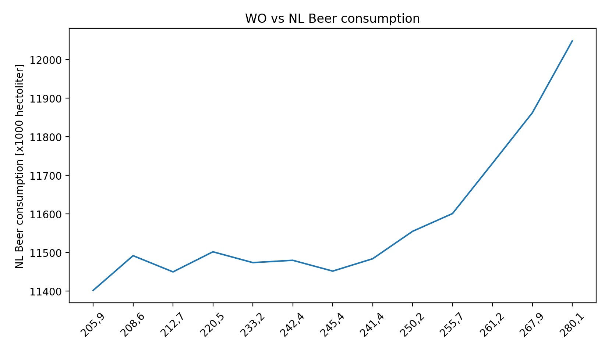

13880624
Fantastic yeasts and where to find them: the hidden diversity of dimorphic fungal pathogens
An analysis of the forces required to drag sheep over various surfaces
Uterine contractility and embryo implantation

This plot show a correlation between the two, because they both grow.